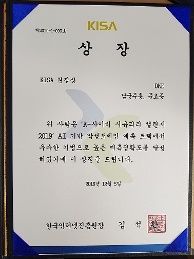

# K-Cyber #  
    
사이버보안 빅데이터 챌린지 2019  
-------------  
### AI 기반 악성 도메인 예측
DGA 여부 예측: DGA/정상 도메인 예측
알고리즘 예측: 도메인 생성 알고리즘 예측

- 팀명: DKE  
- 팀원: 남궁주홍, 문효종  
- http://securitybigdata.kr/title.php  
  
   
-------------  
### DGA(Domain Generaion Algorithm)
- 특정한 규칙에 따라 많은 수의 도메인을 생성하는 알고리즘
- C&C 서버를 숨기기 위해 사용
	* C&C 서버: 공격자(해커)가 PC/서버를 장악한 후 원하는 명령을 하기 위한 서버
 
   
###### [그림 출처]: https://hackersterminal.com/domain-generation-algorithm-dga-in-malware/

-------------  
### 딥러닝 기반 DGA 예측
1. 문제 정의
 - 도메인 문자를 입력으로 DGA 알고리즘(0~19) 예측 
 - DGA 알고리즘 0: 정상 도메인
 - DGA 알고리즘 n (n≠0): DGA 도메인
2. 데이터 학습 및 예측
	1) 입력 도메인을 int vector로 변환
	ex) vsviqe.com --> [[32,29,32,19,27,15,76,13,25,23] ]
	2) 최대 길이(len=74)로 padding 
	ex)  [[32,29,32,19,27,15,76,13 25,23]] --> [0,0,0,0,…,13,25,23]]
	3) 딥러닝 모델 학습
	4) DGA 알고리즘 예측하여 0이면 정상 도메인, 1~19면 DGA 도메인

----------  
### Directory List(dke.cs.knu)  
  
- data  
  - preprocess.py: 데이터 분포 확인  
- round1(예선)  
  - final: 전체 데이터 모델  
      - alg: 모델 코드  
      - result: confusion matrix(정확도 확인)  
      + submit.py: test_data에 대한 제출 파일 생성  
  - train: 학습 데이터 모델     
      - alg: 모델 코드  
      - models: 최종 모델(.h5, .json)  
      - stacking: 스태킹 코드  
  - result_board.xlsx: 실험 결과 엑셀 파일  
      
- round2(본선)  
  - final: 본선 데이터 모델  
  - train: 본선 데이터 모델(후보)